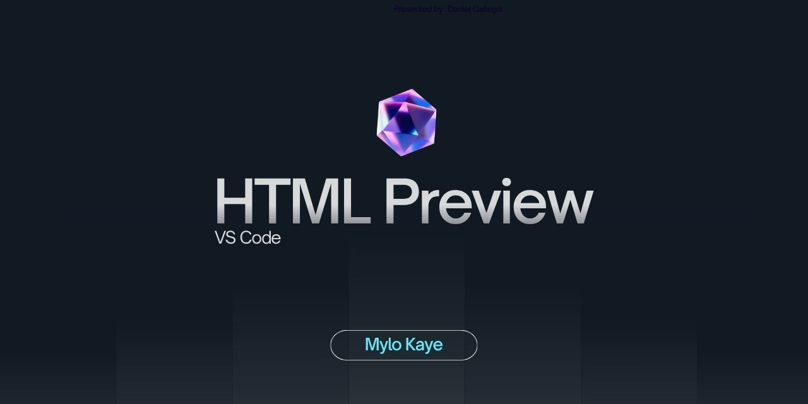

# VS HTML Preview

Preview HTML files in a browser-like VS Code panel, including GitHub remote workspaces.

[GitHub repository](https://github.com/mylokaye/vs-preview) · [Mylo Kaye's website](https://mylokaye.me)

## Features

- Opens `.html` and `.htm` files in a browser-like preview panel.
- Refreshes the preview as you edit the HTML document.
- Resolves relative images, stylesheets, and scripts from the HTML file's folder.
- Supports local folders and virtual workspaces, including GitHub repositories opened in VS Code.

## Use

1. Open an HTML file.
2. Run **Preview HTML** from the Command Palette, or use **Preview HTML** in the editor title or context menu.

The preview opens beside the editor. If the panel is already open for the file, the command brings it back into view.

## GitHub repositories

Open a repository with the GitHub Repositories extension or in VS Code for the Web, then open an HTML file and run **Preview HTML**. The extension uses VS Code's workspace resource URIs, so the repository does not need to be cloned locally.

## Security and privacy

HTML is rendered in a sandboxed webview. Scripts in the preview can run, but the preview cannot access the VS Code extension API. Workspace resources are limited to the HTML file's folder, and the content security policy permits HTTPS external resources. The extension itself does not transmit workspace files or collect telemetry; code in the preview may make network requests to HTTPS services.

## Development

Open this folder in VS Code and press **F5** to launch an Extension Development Host. In that window, open an HTML file and run **Preview HTML**.

## License

This project is licensed under the MIT License. See [LICENSE](LICENSE).
